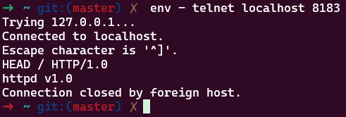
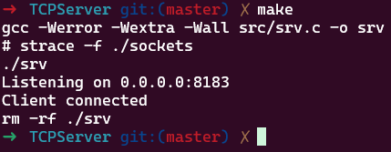

# TCP Server (C Language)

Этот код реализует простой TCP-сервер, который принимает подключения, читает данные от клиента и отправляет ответ "httpd v1.0".

## Содержание
1. [Описание](#описание)
2. [Зависимости](#зависимости)
3. [Сборка](#сборка)
4. [Аргументы функций](#аргументы-функций)
5. [Пример использования](#пример-использования)

---

## Описание
Сервер выполняет:
1. Создание TCP-сокета
2. Привязку к адресу `0.0.0.0:8183`
3. Прослушивание входящих подключений
4. Принятие одного клиента
5. Чтение данных от клиента
6. Отправку ответа
7. Закрытие соединения

---

## Зависимости
- Компилятор C (например, `gcc`)
- Linux-система (для работы с сокетами)

---

## Сборка
    make

--- 
## Аргументы функций

### `socket(int domain, int type, int protocol)`
| Аргумент    | Значение       | Описание                          |
|-------------|----------------|-----------------------------------|
| `domain`    | `AF_INET`      | Семейство адресов: IPv4           |
| `type`      | `SOCK_STREAM`  | Тип сокета: потоковый (TCP)       |
| `protocol`  | `0`            | Протокол по умолчанию для TCP     |

---

### `bind(int sockfd, const struct sockaddr *addr, socklen_t addrlen)`
| Аргумент    | Значение                  | Описание                          |
|-------------|---------------------------|-----------------------------------|
| `sockfd`    | `server`                  | Дескриптор сокета, созданный `socket()` |
| `addr`      | `(struct sockaddr*)&srv`  | Указатель на структуру адреса сервера (`sockaddr_in`) |
| `addrlen`   | `sizeof(srv)`             | Размер структуры `sockaddr_in`    |

---

### `listen(int sockfd, int backlog)`
| Аргумент    | Значение      | Описание                          |
|-------------|---------------|-----------------------------------|
| `sockfd`    | `server`      | Дескриптор сокета                 |
| `backlog`   | `5`           | Максимальная длина очереди ожидающих подключений |

---

### `accept(int sockfd, struct sockaddr *addr, socklen_t *addrlen)`
| Аргумент    | Значение                  | Описание / Замечание              |
|-------------|---------------------------|-----------------------------------|
| `sockfd`    | `server`                  | Дескриптор сокета                 |
| `addr`      | `(struct sockaddr*)&srv`  | **Ошибка в коде**: должно быть `&cli` для сохранения адреса клиента |
| `addrlen`   | `&addrlen`                | Указатель на переменную с размером структуры `addr` (должна быть инициализирована перед вызовом) |

---

### `read(int fd, void *buf, size_t count)`
| Аргумент    | Значение      | Описание                          |
|-------------|---------------|-----------------------------------|
| `fd`        | `client`      | Дескриптор клиентского сокета     |
| `buf`       | `buf`         | Буфер для сохранения данных (512 байт) |
| `count`     | `511`         | Максимальное количество байт для чтения |

---

### `write(int fd, const void *buf, size_t count)`
| Аргумент    | Значение          | Описание                          |
|-------------|-------------------|-----------------------------------|
| `fd`        | `client`          | Дескриптор клиентского сокета     |
| `buf`       | `data` (`"httpd v1.0\n"`) | Данные для отправки       |
| `count`     | `strlen(data)`    | Длина строки `data` в байтах      |

---

### `close(int fd)`
| Аргумент    | Значение      | Описание                          |
|-------------|---------------|-----------------------------------|
| `fd`        | `client`/`server` | Дескриптор сокета (клиентский или серверный) |

---
## Пример использования

| Шаг 1: Сервер | Шаг 2: Клиент |
|---------------|---------------|
|  |  |
| Сервер запущен на порту 8183 | Клиент получает ответ "httpd v1.0" |
